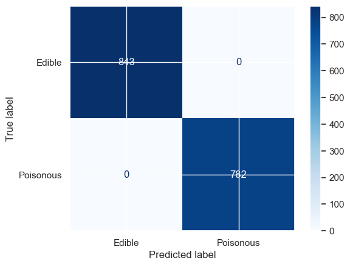

# 🍄 Mushroom Classification

This project focuses on building a machine learning model to classify mushrooms as edible or poisonous. The classification is performed using neural networks as well as a random forest classifier to compare the performance of the two models.

## Project Overview

Mushroom classification is a critical task in ensuring safety when identifying edible mushrooms. This project leverages machine learning techniques to achieve accurate classification.

## Dataset

The dataset was acquired from the UC Irvine Machine Learning Repository and contains various features of mushrooms, such as cap shape, color, and odor. Each mushroom is labeled as either edible or poisonous and the two outcomes are almost equally weighted in the dataset.

## Project Workflow
Below are the list of steps taken to build the model: 
1. **Data Import and EDA:**
    - Fetch data from UCI repo 
    - Basic EDA to understand dataset 
2. **Data Preprocessing**:
    - Impute missing values 
    - One Hot encode all categorical features 
    - Label encode response variable 
3. **Model Training:**
    - Build and train a neural network model
    - Build and train a random forest classifier 
4. **Model Evaluation:**
    - Visualize model performance using Confusion Matrix 
    - Assess the model's performance using metrics like accuracy and F1-score.
5. **Model Comparison & Selection:**
    - Compare metrics on both models to select best model

## Requirements

- Python 3.8 and above
- Libraries: NumPy, pandas, scikit-learn, TensorFlow/Keras, matplotlib

## Results
I implemented and evaluated two classification models on the UCI Mushroom dataset:

### 1. **Neural Network Classifier**
- Architecture: 2 hidden layers, each with 64 neurons  
- Activation function: `sigmoid`  
- Purpose: Binary classification (edible vs. poisonous)

**Confusion Matrix:**

---

### 2. **Random Forest Classifier**
- Standard Scikit-learn implementation using default hyperparameters  
- Used as a baseline ensemble model

**Confusion Matrix:**

---

### 📊 Model Comparison

| Metric       | Neural Network | Random Forest |
|--------------|----------------|----------------|
| Accuracy     | 1.00           | 1.00           |
| Precision    | 1.00           | 1.00           |
| Recall       | 1.00           | 1.00           |
| F1 Score     | 1.00           | 1.00           |

Both models achieved **perfect performance** on the test data, which is likely due to the highly separable nature of the features in the mushroom dataset. Due to the nature of the dataset, both models are suitable for this classification task. 

## Future Work

- Experiment with dimensionality reduction techniques (e.g. PCA).
- Further optimize the neural network architecture.
- Deploy the model as a web application.

## License

This project is licensed under the MIT License.
